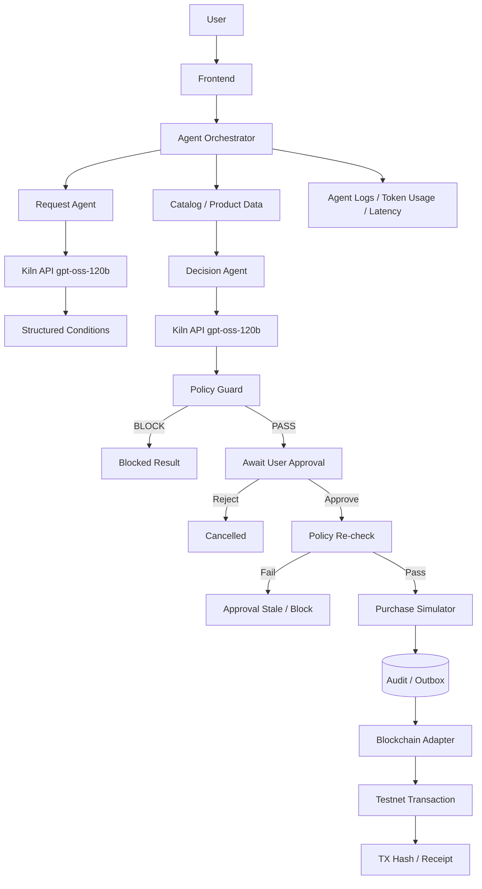

# GWDC FuriosaAI × Bricksum Challenge A — AI Agent Architecture

> 문서 상태: 향후 구현을 위한 설계다. 이번 변경은 문서 추가이며 앱 구현, 실제 Kiln 호출 또는 testnet TX 성공을 의미하지 않는다.

**FuriosaAI × Bricksum Challenge A 공식 구현 기준 (이번 사용자 지정): Kiln API / `gpt-oss-120b`.** 기존 `README.md`, `PROJECT.md`, `AGENTS.md`, `ROLE_BACKEND_AGENT.md`의 `Qwen3-32B` 표기는 이번 작업에서 변경하지 않는다. 이 문서의 모델 기준으로 향후 연동하되, 실제 base URL·인증·정확한 `KILN_MODEL` 식별자는 운영진 자료로 확인한다.

공통 API·모델·Protocol은 [CONTRACTS.md](CONTRACTS.md) v1을 우선한다. 아래 USDT·수수료·간략 JSON·상태명·인터페이스·폴더 트리는 역할을 설명하는 개념 예시이며, 공통 계약을 추가하거나 변경하지 않는다. 실제 연결 시에는 다음 기준을 적용한다.

| 설계 표현 | 기존 계약 v1에 적용할 기준 |
|---|---|
| USDT / `max_budget: 50`, 별도 수수료 | MVP 금액은 **KRW 정수**, 수량 1개, 총액은 `price + shipping_fee`. USDT와 수수료 예시는 산술 설명용이며 구현 범위가 아니다. 체인 가스는 구매 예산과 별도다. 지원 확대는 계약 변경이 선행되어야 한다. |
| Request Agent의 간략 JSON | `PolicyDraft`로 검증 후 누락은 `NEEDS_CLARIFICATION`. 조건이 채워지면 `AWAITING_POLICY_CONFIRMATION`으로 사용자 확인을 받고 `PolicyInput`/서버 `Policy`를 저장한다. `product`는 `query`, `merchant`는 Product의 `merchant_id`, `shipping`은 `shipping_fee`에 대응한다. 계약 필수 카테고리·배송일·만료도 확정해야 한다. |
| `WAITING_APPROVAL`, `Cancelled`, `PASS` | 요청 상태는 `AWAITING_APPROVAL`, 사용자 거절은 `REJECTED`. PASS는 설명용 표현이며 `PolicyDecision.allowed=true`와 전체 `checks` 통과로 판정한다. `APPROVAL_STALE`는 요청 상태 enum이 아니라 409 오류 코드다. |
| 단일 `reason_code` 예시 | 실제 `PolicyDecision`은 `reason_codes[]`, `checks[]`, `decision_id`, `evaluated_at`, `policy_version`을 포함한다. 모든 후보를 PolicyPort로 검사하고 통과 후보만 승인 가능하다. |
| `POST /api/blockchain/audit` | 역할 경계를 설명하는 개념이며 신규 HTTP API를 만들지 않는다. Backend outbox 워커가 기존 `ChainPort.submit_audit(record)` / `get_receipt(record)`를 호출한다. HTTP 업무 API는 `/api/v1/requests/...`다. |
| `CatalogPort.search()` / `get()`, `PurchaseSimulator.execute()` | 실제 Protocol은 `CatalogPort.search_products(policy)`, `get_product(product_id)`, `SimulatorPort.execute_simulated_purchase(approval, purchase_id, idempotency_key, now)`다. 아래 축약 명칭으로 별도 Protocol을 만들지 않는다. |
| Frontend의 간략 결과 / `kiln_usage` | 실제 업무 응답은 `RequestView`이며 `policy_draft`, `policy`, `candidates`, `selected_recommendation_id`, `approval`, `purchase`, `chain` 등을 사용한다. usage는 `GET /api/v1/requests/{id}/logs`의 `usage: UsageLog[]`로 받는다. 초기 chain은 `null`, 미제출 ChainRecord는 `NOT_SUBMITTED`. 승인 대기 중 `PENDING`으로 표시하지 않는다. |
| 단계 이름 / usage | 실제 `UsageLog.stage`는 `extract` / `recommend`, `usage_source`는 `provider` / `estimate` / `unavailable`. Energy의 Measured / Estimated / Unavailable 표기는 관측 보고서 표현이며 별도 API enum 추가가 아니다. |
| 권장 폴더 트리 | 기존 소유 경로 `backend/app/agent/`, `orchestration/`, `contracts/`, `api/`, `persistence/`, `policy/`, `blockchain/`, `catalog/`, `simulator/`를 따른다. Backend가 다른 담당자의 내부 구현을 복제하지 않는다. |

관련 실행 순서는 [TEAM_PLAN.md](TEAM_PLAN.md), 검증 시나리오는 [AGENT_DEMO_SCENARIOS.md](AGENT_DEMO_SCENARIOS.md)를 참고한다.

## 1. Agent 목표

이 프로젝트는 다음 기능을 구현한다.

```text
사용자가 지정한 예산, 판매처, 카테고리, 배송 조건을 지키면서
상품을 탐색·추천하고,
사용자 승인 후 모의 구매를 실행하며,
해당 구매의 감사 기록을 blockchain testnet에 남기는
AI 구매 Agent.
```

Kiln의 `gpt-oss-120b`를 AI 판단에 실제 사용한다.

하지만 모든 판단을 LLM에게 맡기지 않는다.

핵심 원칙은 다음과 같다.

```text
LLM = 자연어 이해 + 후보 설명/추천

Code = 정책 검증 + 승인 + 금액 계산 + 중복 방지 + 실행 통제

Blockchain = 승인된 실행의 감사 증거
```

---

## 2. 전체 Architecture

전체 구매·승인·감사 흐름은 다음과 같다. 다이어그램의 상태 표시명은 위 계약 대응표를 따른다.



---

## 3. Agent Orchestrator

Agent의 가장 중요한 컴포넌트는 `Agent Orchestrator`다.

Agent Orchestrator는 다음 순서를 관리한다.

```text
1. 사용자 요청 수신
2. Kiln API를 이용해 사용자 조건 추출 (검증·추가 질문 및 사용자 정책 확인 포함)
3. 상품 데이터 조회
4. Kiln API를 이용해 후보 비교/설명
5. Policy Guard 실행
6. 사용자 승인 대기
7. 승인 후 정책 재검증
8. 모의 구매 실행
9. 감사 데이터 생성
10. Blockchain 기록 요청
11. Transaction Hash / Receipt 연결
12. Token Usage / Latency / Agent Log 기록
```

Agent가 blockchain private key에 직접 접근하지 않도록 한다.

Agent가 Policy Guard를 우회할 수도 없어야 한다. 상품 설명 등 외부 텍스트의 지시가 정책·도구 권한을 바꾸지 못하도록 한다. 서버는 세션 소유권, CSRF, 정책 버전과 상태 전이도 검증한다.

---

## 4. Request Agent

예를 들어 사용자가 다음 요청을 한다.

```text
50 USDT 이내에서 무선 이어폰을 찾아줘.
Merchant A와 Merchant B만 허용하고
배송비까지 포함해서 50 USDT를 넘으면 구매하지 마.
```

Request Agent는 Kiln `gpt-oss-120b`를 통해 이를 구조화한다.

예:

```json
{
  "intent": "purchase",
  "product": "wireless earbuds",
  "max_budget": 50,
  "currency": "USDT",
  "allowed_merchants": [
    "MerchantA",
    "MerchantB"
  ],
  "include_shipping": true
}
```

LLM 결과는 그대로 신뢰하지 않는다.

Pydantic 등 서버의 deterministic validation을 반드시 통과시킨다.

필수 조건이 없으면 임의 추론하지 말고 clarification 상태로 전환한다.

---

## 5. Decision Agent

Catalog에서 받은 상품 후보를 비교한다.

예:

```json
[
  {
    "product_id": "P001",
    "merchant": "MerchantA",
    "price": 42,
    "shipping": 3
  },
  {
    "product_id": "P002",
    "merchant": "MerchantB",
    "price": 38,
    "shipping": 8
  }
]
```

Kiln API에는 실제 Catalog에서 조회된 후보만 전달한다.

Decision Agent의 역할은 다음으로 제한한다.

```text
후보 비교
사용자 조건과 후보 관계 설명
가장 적합한 후보 추천
추천 이유 생성
```

Decision Agent는 결제 승인 권한이 없다.

예:

```json
{
  "selected_product_id": "P001",
  "reason": "전체 비용이 예산 범위 안에 있으며 배송 조건이 더 적합합니다."
}
```

---

## 6. AI와 Code 역할 분리

AI와 deterministic code의 책임은 다음과 같이 나눈다.

| 기능 | AI / Kiln | Code |
|---|---|---|
| 자연어 의도 분석 | O | |
| 조건 구조화 | O | 검증 |
| 상품 설명 | O | |
| 후보 추천 | O | |
| 예산 계산 | | O |
| 배송비 계산 | | O |
| Merchant whitelist | | O |
| Category whitelist | | O |
| Deadline | | O |
| 재고 검증 | | O |
| 승인 검증 | | O |
| 중복 구매 방지 | | O |
| Idempotency | | O |
| Blockchain 실행 제어 | | O |
| Private key 접근 | | Blockchain Adapter only |

실행 권한은 다음 원칙으로 제한한다.

```text
AI는 추천할 수 있지만 승인할 수 없다.

AI는 상품을 선택할 수 있지만 정책을 우회할 수 없다.

AI 응답이 잘못되어도 Policy Guard가 실행을 차단해야 한다.
```

---

## 7. Policy Guard

Policy Guard는 deterministic code로 구현한다.

최소 검사 조건:

```text
budget
shipping
merchant
category
deadline
approval expiration
inventory
transaction count
data validity
```

예:

```text
상품 가격: 42
배송비: 3
수수료: 2

Total = 47

Budget = 50

47 <= 50

PASS
```

반대로:

```text
상품 가격: 45
배송비: 5
수수료: 3

Total = 53

Budget = 50

53 > 50

BLOCKED
BUDGET_EXCEEDED
```

Policy Guard 결과는 구조화된 reason code를 반환한다.

예:

```json
{
  "allowed": false,
  "reason_code": "BUDGET_EXCEEDED",
  "budget": 50,
  "total_cost": 53
}
```

---

## 8. 사용자 승인

Policy PASS만으로 구매해서는 안 된다.

흐름:

```text
AI Recommendation
↓
Policy PASS
↓
WAITING_APPROVAL
↓
User Approve
↓
Policy Re-check
↓
Purchase
```

승인 이후 다음 중 하나가 달라지면 기존 승인은 무효화한다.

```text
price
stock
policy
budget
merchant
deadline
approval expiration
```

결과:

```text
APPROVAL_STALE
```

로 처리하고 다시 승인을 받아야 한다. 가격·재고·상품 버전·배송비·배송일 등 Product 스냅샷 전체와 정책 해시·최종 총액·만료를 비교한다. 승인 자체는 서버가 발급하며 클라이언트의 approved 플래그를 신뢰하지 않는다.

---

## 9. 중복 구매 방지

다음 기능을 구현해야 한다.

```text
Idempotency-Key
DB unique constraint
transaction / lock
request_id
purchase_id
```

동일 approve 요청을 두 번 보내거나 동시에 요청해도 논리적 purchase는 최대 1개만 생성한다.

Blockchain timeout 때문에 purchase를 다시 실행해서도 안 된다. 동일 키·동일 본문은 기존 결과를 반환하고 동일 키·다른 본문은 409 IDEMPOTENCY_CONFLICT로 거절한다. 다른 키를 사용해도 구매 테이블의 request_id 고유 제약으로 중복을 막는다. Backend는 트랜잭션 안에서 요청 확보 → 최신 정책 재검사 → 순수 simulator 호출 → 영수증/횟수/outbox 저장을 수행한다. 체인 호출은 구매 DB 트랜잭션 밖에서 수행한다.

---

## 10. Blockchain 연결

Blockchain 담당과 Agent 사이에는 명확한 interface를 둔다.

예:

```http
POST /api/blockchain/audit
```

요청 개념:

```json
{
  "request_id": "req_001",
  "purchase_id": "purchase_001",
  "audit_hash": "sha256-value"
}
```

Blockchain 담당은 실제 허용된 devnet/testnet에서 감사 기록을 제출한다.

응답 개념:

```json
{
  "status": "CONFIRMED",
  "network": "testnet",
  "tx_hash": "0x123456789"
}
```

Blockchain 상태는 purchase 상태와 분리한다. 실제 ChainRecord에는 NOT_SUBMITTED 및 adapter_mode=mock|live도 포함한다. mock TX는 실제 testnet 증거로 표시하지 않는다. AuditRecord 원문은 오프체인에 보관하고 CONTRACTS 6절의 UTF-8·키 정렬·공백/BOM 없음·정수 금액·UTC 시각 정규화와 SHA-256 규칙을 적용한다. record_id는 Backend가 한 번만 발급한다. 온체인에는 감사 해시와 최소 식별 정보만 기록하고 자연어 원문·신원·비밀값은 넣지 않는다. 해시는 원문의 변조 여부를 검증하며 원본 데이터의 진실성을 자동 보증하지 않는다.

지원할 상태 예:

```text
PENDING
CONFIRMED
FAILED
UNKNOWN
```

---

## 11. Data 담당과 연결

Data / Integration 담당은 다음을 제공한다.

```text
상품 fixture
상품 검색
상품 상세 조회
Purchase Simulator
모의 영수증
```

예상 interface:

```text
CatalogPort.search()
CatalogPort.get()
PurchaseSimulator.execute()
```

Agent는 데이터 담당자의 기능을 직접 중복 구현하지 않는다.

---

## 12. Frontend 담당과 연결

Frontend에 반환할 Agent 결과에는 최소한 다음 정보가 포함되어야 한다.

```json
{
  "request": {
    "product": "wireless earbuds",
    "budget": 50
  },
  "agent": {
    "selected_product": "P001",
    "reason": "조건을 만족하는 후보 중 전체 비용과 배송 조건이 적합합니다."
  },
  "policy": {
    "status": "PASS",
    "budget": 50,
    "total_cost": 47
  },
  "approval": {
    "status": "WAITING_APPROVAL"
  },
  "blockchain": {
    "status": "PENDING",
    "tx_hash": null
  },
  "kiln_usage": {
    "model": "gpt-oss-120b",
    "prompt_tokens": null,
    "completion_tokens": null,
    "total_tokens": null
  }
}
```

API가 token usage 값을 제공하지 않는 경우 0으로 조작하지 말고 `null` 또는 `unavailable`로 표현한다.

---

## 13. Kiln API 사용 전략

Kiln API의 `gpt-oss-120b`는 실제 workflow에서 사용한다.

주요 inference stage:

```text
Stage 1
Request / Condition Extraction

Stage 2
Candidate Explanation / Recommendation
```

단순 숫자 비교에는 LLM을 호출하지 않는다.

다음은 code가 처리한다.

```text
42 + 3 <= 50
merchant whitelist
deadline
inventory
approval expiration
duplicate protection
```

각 Kiln 호출에 다음을 기록한다.

```text
request_id
call_id
stage
model
attempt
latency_ms
prompt_tokens
completion_tokens
total_tokens
```

retry가 발생하면 retry token 사용량도 합계에 포함한다. 타임아웃·재시도·응답 길이·후보 수에 한도를 두고 live 장애를 mock 성공으로 대체하지 않는다. API 키·인증 헤더·개인키를 로그나 화면에 남기지 않는다. 일부 시도의 usage가 미제공이면 알려진 토큰 소계와 미제공 시도 수를 구분하고 완전한 합계로 표시하지 않는다.

---

## 14. Energy / Efficiency

Challenge 요구사항에 따라 token usage를 전체 합계 하나로만 보여주지 않는다.

stage별로 분리한다.

예:

```text
Intent / Condition Extraction
Prompt Tokens
Completion Tokens
Total Tokens
Latency

Candidate Recommendation
Prompt Tokens
Completion Tokens
Total Tokens
Latency
```

Energy 값이 Kiln API에서 직접 제공되지 않는 경우 실제 측정값처럼 작성하지 않는다.

다음처럼 구분한다.

```text
Measured
Estimated
Unavailable
```

추정값이라면 산식과 가정을 문서에 기록한다.

---

## 15. Demo Scenario

최소 두 번의 end-to-end 실행을 준비한다.

### Scenario A — 정상 경로

```text
Budget: 50,000 KRW
Merchant: 허용
Product Total: 45,000 KRW
```

결과:

```text
AI Candidate Selected
↓
Policy PASS
↓
User Approve
↓
Policy Re-check PASS
↓
Mock Purchase
↓
Audit Record
↓
Testnet Transaction
↓
TX Hash
```

### Scenario B — 예산 초과

같은 상품에서:

```text
Budget: 30,000 KRW
Product Total: 45,000 KRW
```

결과:

```text
Policy BLOCKED
Reason: BUDGET_EXCEEDED
Purchase: NONE
Blockchain Payment: NONE
```

차단도 정상적인 실행 결과로 기록한다.

---

## 16. 장애 시 안전 동작

다음 상황에서는 구매가 실행되면 안 된다.

```text
Kiln timeout
Kiln invalid JSON
Kiln hallucinated product ID
Catalog unavailable
Policy engine error
Approval expired
Price changed
Inventory changed
Blockchain timeout
```

특히 Blockchain timeout은 구매 재실행 사유가 아니다.

기존 audit record / transaction 상태를 먼저 조회한다. 위 목록의 Blockchain timeout이 구매 완료 후 발생하면 이미 확정된 모의 구매와 영수증은 유지하며, 추가 구매를 금지하고 체인 상태만 UNKNOWN/PENDING으로 복구한다. 구매 전에 필수 검증이 실패하면 fail-closed로 중단한다.

---

## 17. 권장 Backend 구조

향후 구현 시 다음 구조를 기준으로 한다.

```text
backend/
├── app/
│   ├── main.py
│   │
│   ├── agents/
│   │   ├── orchestrator.py
│   │   ├── request_agent.py
│   │   └── decision_agent.py
│   │
│   ├── services/
│   │   ├── kiln_service.py
│   │   ├── policy_service.py
│   │   ├── catalog_service.py
│   │   ├── purchase_service.py
│   │   └── blockchain_service.py
│   │
│   ├── models/
│   ├── api/
│   └── logging/
│
└── tests/
```

하지만 현재 저장소의 `CONTRACTS.md` 및 실제 구현 구조가 이 구조와 다르면 기존 계약/구조를 우선한다.

임의로 저장소를 대규모 재구성하지 않는다.

---

## 18. 역할 관계

담당자 간 연결 관계는 다음과 같다.

```text
민진 / Frontend
        │
        ▼
윤석 / Backend + AI Agent
        │
        ├──────────────┐
        ▼              ▼
민규 / Data       시우 / Policy + Blockchain
```

윤석의 Agent는 전체 기능을 연결하는 orchestration layer이다.

하지만 각 담당자의 내부 구현을 복제하지 않는다.
