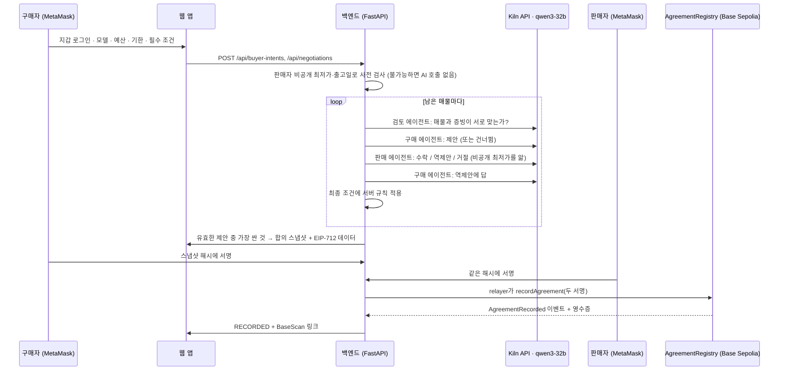

# Agent Accord

[English](README.md) · **한국어**

**Agent Accord는 Kiln 기반 AI 에이전트가 구매자와 판매자 각자의 비공개 한도 안에서 중고 GPU 거래를 대신 협상하고, 두 사람이 같은 합의 내용에 각자 지갑으로 서명했을 때만 그 합의를 Base Sepolia에 기록하는 서비스입니다.**

Track A · GWDC 2026 × Bricksum · 제출 브랜치: `main`

| | |
|---|---|
| **AI (Kiln `qwen3-32b`)** | 매물마다 증빙을 검토하고, 구매자 쪽 제안을 내고, 판매자 쪽에서 수락·역제안·거절로 답하고, 역제안에 답합니다. 위험하다고 판단한 매물은 건너뜁니다 |
| **서버 규칙** | 예산, 판매자 최저가, 배송 기한, 재고, 필수 조건을 코드로 검사합니다. 규칙을 어긴 AI 답은 버리고 한 번 다시 묻고, 그래도 어기면 그 매물을 차단합니다 |
| **체인** | `AgreementRegistry`가 **두 사람의** EIP-712 서명을 체인에서 직접 검증한 뒤에만 합의 해시를 저장합니다. 결제와 배송은 다루지 않습니다 |

## 데모 실행 (Track A)

모든 행은 실제 실행입니다. Kiln을 실제로 호출했고, 두 사람이 서명한 경우 Base Sepolia에 실제 트랜잭션이 남았습니다. 호출별 로그는 [`docs/PROOF.md`](docs/PROOF.md)에 있습니다.

| 실행 | 조건 | 에이전트가 한 일 | 결과 |
|---|---|---|---|
| 1 · 정상 실행 | 예산 ₩2,400,000 · 10일 | 매물 3개를 검토. 구매 에이전트가 **Gaming OC를 건너뜀**(보증 조회 결과가 다른 모델). 셀러 01의 판매 에이전트가 가격 규칙을 두 번 어겨 서버가 차단. ROG Strix의 판매 에이전트가 역제안하고 구매 에이전트가 수락 | ROG Strix ₩2,105,000. 웹 화면에서 MetaMask로 양측 서명 후 기록 |
| 2 · 예산 변경 | 예산 ₩2,000,000 | 예산으로 닿을 수 없는 매물 2개를 서버가 **AI 호출 전에** 제외. 에이전트가 Founders Edition으로 합의 | ₩1,920,000, 기록 |
| 3 · 기한 변경 | 배송 기한 3일 | 기한 안에 출고할 수 없는 매물은 AI 호출 전에 제외. 판매 에이전트가 가격·도착일로 역제안 | ₩1,940,000, 기록 |
| 4 · 목표 불가 | 예산 ₩1,000,000 | 모든 매물이 판매자 최저가 아래라서 매물마다 사유를 남기고 **거절**. Kiln 토큰을 쓰지 않음 | 합의 없음. 서명·기록할 대상이 없음 |

거절은 조용히 끝나지 않습니다. 멈춘 지점마다 사유 코드와 함께 감사 이벤트가 남습니다(`CANDIDATE_BLOCKED`, `LISTING_SKIPPED`, `COUNTER_REJECTED`, `OFFER_REJECTED` 등). 웹 화면의 **기록** 탭에서 볼 수 있습니다.

## API 사용 증빙 (흐름별)

<!-- proof:start -->

| Flow | Buyer condition | Kiln calls | Kiln cost | Agreement | Signed by | On-chain tx |
|---|---|---|---|---|---|---|
| 1 · 정상 실행 (웹 · MetaMask) | RTX 4090 · 예산 2,400,000원 · 기한 2026-10-10 | 8/11 | $0.000578 | RECORDED 2,105,000원 | MetaMask in the web UI | [`0x42099967…1ca1e6`](https://sepolia.basescan.org/tx/0x42099967ade43a437993739e40e400be50b007f1516a875fc0fbfc24811ca1e6) |
| 2 · 예산 변경 재실행 | RTX 4090 · 예산 2,000,000원 · 기한 2026-10-09 | 3/3 | $0.000171 | RECORDED 1,920,000원 | local test wallets via scripts/run_flows.py | [`0x8dbadc19…804919`](https://sepolia.basescan.org/tx/0x8dbadc1998fb60276992c5a53c23bd746edd4577265d5a84a9e64c830d804919) |
| 3 · 기한 변경 재실행 | RTX 4090 · 예산 2,400,000원 · 기한 2026-10-02 | 4/4 | $0.000206 | RECORDED 1,940,000원 | local test wallets via scripts/run_flows.py | [`0x92d71f32…96c269`](https://sepolia.basescan.org/tx/0x92d71f32579b00f205b4aec6c0646060f75d81f3fc4dcc278ae31614e296c269) |
| 4 · 목표 불가 → 거절 | RTX 4090 · 예산 1,000,000원 · 기한 2026-10-10 | 0/0 | $0.000000 | BLOCKED  | - | - |
| (참고) 첫 MetaMask 실행 | RTX 4090 · 예산 2,400,000원 · 기한 2026-10-09 | 10/12 | $0.000636 | RECORDED 2,105,000원 | MetaMask in the web UI | [`0x10afa7be…616ec2`](https://sepolia.basescan.org/tx/0x10afa7beea789bb553967366342599273839c29536e641eacc1b1851fc616ec2) |

- Total Kiln cost for these flows: $0.001591 · 15,626 tokens
- Model calls avoided: 7 candidate(s) failed the server's budget/deadline pre-check, so no Kiln call was made for them (about 3 calls each: assessment, buyer offer, seller reply).
- Energy (assumption, not a measurement): at 0.3 Wh per 1,000 tokens, ≈ 4.69 Wh for these flows.

Full per-call log: [docs/PROOF.md](docs/PROOF.md)

<!-- proof:end -->

읽는 법:

- **Kiln calls `ok/total`**: `OK`가 아닌 호출은 규칙을 어겨 한 번 다시 물은 답(`INVALID_OUTPUT`)이거나 제공자 오류입니다. 숨기거나 몰래 재시도한 호출은 없습니다.
- **Kiln 로그** ([`docs/proof/kiln_calls.jsonl`](docs/proof/kiln_calls.jsonl)): 호출마다 한 줄씩 남습니다. Kiln generation id(`x-neocloud-generation-id`), 입력·출력·추론 토큰, `usage.cost`, 지연 시간, 결과, 검증을 통과한 JSON 답이 들어 있습니다. 프롬프트 원문(SHA-256만 기록)과 키는 없습니다.
- **온체인**: 각 트랜잭션은 [`0x265756b7d5C4CeEd6976F87E54E44ED0921ac013`](https://sepolia.basescan.org/address/0x265756b7d5C4CeEd6976F87E54E44ED0921ac013)의 `recordAgreement`를 호출하고 `AgreementRecorded` 이벤트를 남깁니다. `scripts/export_proof.py --verify`가 모든 영수증을 RPC에서 다시 조회합니다. 배포 트랜잭션은 [`0x63d48e4b…ec5ab6`](https://sepolia.basescan.org/tx/0x63d48e4bcd3891bc591b8e1aa2d998097c060cb58a68b9b8e9fe247e6bec5ab6)입니다.
- **서명 주체**: 실행 1과 (참고)는 브라우저에서 MetaMask 계정 2개로 서명했습니다. 실행 2·3은 [`scripts/run_flows.py`](scripts/run_flows.py)가 같은 HTTP API와 같은 컨트랙트로 진행했고, 로컬 테스트 지갑으로 서명했습니다.
- **실행 4**에는 트랜잭션이 없습니다. 서명할 합의가 없기 때문입니다. 감사 기록은 `docs/proof/flows.json`에 있습니다.

## 동작 방식



**Kiln** ([`backend/agent.py`](backend/agent.py))
- OpenAI 호환 `POST https://api.bricksum.com/v1/chat/completions`를 쓰고, 모델은 `GET /models`로 확인합니다.
- Qwen3를 `/no_think`로 돌려 호출당 1~3초가 걸립니다.
- 답에서 `<think>` 블록과 코드펜스를 걷어내고 첫 JSON 객체만 쓰며, 코드로 검증합니다.
- 429·5xx·타임아웃은 `retry-after`를 따라 최대 3번 시도합니다. 401·402는 `KILN_AUTH_FAILED` / `KILN_CREDITS_EXHAUSTED`로 남깁니다.

**체인** ([`contracts/src/AgreementRegistry.sol`](contracts/src/AgreementRegistry.sol), [`blockchain/`](blockchain))
- 스냅샷(가격, 총액, 배송, 보증, 증빙 해시, 양측 지갑, 만료, 구매자 nonce)을 RFC 8785로 정규화해 해시하고, 두 사람이 같은 EIP-712 메시지에 서명합니다.
- relayer만 제출할 수 있습니다. 컨트랙트는 두 서명자를 복원하고, nonce 재사용·만료·중복 합의를 거부합니다.
- 백엔드는 영수증, 이벤트, 저장값이 모두 맞을 때만 `RECORDED`로 표시합니다.

**양쪽의 비공개 정보**
- 구매자 예산은 판매 에이전트와 판매자 화면에 가지 않습니다.
- 판매자 최저가와 출고일은 구매자에게 가지 않습니다.
- 판매 에이전트의 말은 구매자 화면에 금액을 가린 채 보여줍니다.

## 우리 지갑 없이 확인하기

- **증빙 확인에는 지갑이 필요 없습니다.** 위 표의 tx 링크는 BaseScan에서 바로 열리고, Kiln generation id·토큰·비용은 [`docs/PROOF.md`](docs/PROOF.md)와 [`docs/proof/kiln_calls.jsonl`](docs/proof/kiln_calls.jsonl)에 있습니다.
- **공유 데모 사이트는 팀이 등록한 지갑만 로그인할 수 있습니다**(구매자 계정 1개, 판매자 계정 5개). 협상마다 Kiln 크레딧이, 기록마다 relayer 가스가 들고, 합의는 그 매물의 판매자 본인이 서명해야 유효하기 때문입니다. 양측 서명 과정은 데모 영상에서 보여줍니다.
- **직접 해보려면** 아래 mock 모드를 쓰세요. 키도 지갑 허용 목록도 없어서 아무 MetaMask 계정으로 로그인할 수 있고, 에이전트와 체인 단계는 모의로 동작합니다. 실제 Kiln + Base Sepolia로 돌리려면 `.env.local`에 본인 MetaMask 주소 두 개를 넣으면 됩니다(실제 모드 참고).

## 실행 방법

필요한 것: Python 3.12+, Node 20+, Kiln API 키, MetaMask 계정 2개, relayer용 Base Sepolia 테스트 ETH 약간.

```sh
git clone https://github.com/siwooju-dev/agent-accord.git && cd agent-accord
python3 -m venv .venv && .venv/bin/pip install -r backend/requirements.txt
(cd contracts && npm ci && npm run compile)
(cd frontend && npm ci)
```

**키 없이 체험 (mock 에이전트, 체인 없음):**

```sh
bash scripts/run_backend.sh mock                                   # API: 127.0.0.1:8000
cd frontend && npm run dev -- --host 127.0.0.1 --port 5180         # http://127.0.0.1:5180 열기
```

**실제 모드 (Kiln + Base Sepolia):**

```sh
.venv/bin/python scripts/setup_secrets.py         # Kiln 키 붙여넣기(화면에 안 보임). 테스트넷 relayer를 만들고 주소만 출력
# .env.local에 MetaMask 공개 주소 두 개 추가: DEMO_BUYER_WALLET=0x…  DEMO_SELLER_WALLET=0x…
.venv/bin/python scripts/deploy_registry.py       # relayer에 faucet으로 ETH를 받은 뒤 한 번
.venv/bin/python scripts/kiln_smoke.py            # 선택: 체인 없이 Kiln 협상 1회
DATABASE_PATH=data/live.sqlite3 PORT=8001 bash scripts/run_backend.sh live
cd frontend && ACCORD_API_TARGET=http://127.0.0.1:8001 npm run dev -- --host 127.0.0.1 --port 5180
```

화면에서 쓰는 순서:

1. **구매자로 로그인**(계정 1)으로 로그인합니다.
2. **조건 · 매물**에서 조건을 고르고 **이 조건으로 협상 시작**을 누릅니다.
3. **협상** 탭에서 에이전트 대화를 보고, **합의 · 서명**에서 서명합니다.
4. 로그아웃하고 MetaMask를 계정 2로 바꾼 뒤 **판매자로 로그인**으로 같은 합의서에 서명합니다.
5. **기록** 탭에서 이벤트, Kiln 호출, BaseScan 링크를 확인합니다.

추가 명령:

- 스크립트 실행: `.venv/bin/python scripts/run_flows.py A B C`
- 증빙 다시 만들기: `scripts/export_proof.py --db data/live.sqlite3 --db data/live-script.sqlite3 --verify --publish --flow … --label …` (README.md와 README.ko.md의 증빙 표를 함께 갱신)
- ngrok 공유와 전체 QA 체크리스트: [`docs/WEB_QA.md`](docs/WEB_QA.md)

키와 지갑 제한:

- 키는 git에서 제외된 `.env.local`(권한 600)과 백엔드 프로세스에만 있고, 브라우저 번들에는 들어가지 않습니다.
- 실제 모드는 설정한 구매자·판매자 지갑만 로그인할 수 있습니다.
- 구매자 지갑 하나당 한 시간에 협상 20번까지 시작할 수 있습니다(`NEGOTIATIONS_PER_HOUR`).

## 테스트

```sh
.venv/bin/python -m pytest -q backend/tests blockchain/tests     # 58개: API 규칙, 지갑 인증, Kiln 파싱·재시도, 서명, 로컬 EVM
(cd frontend && npm test && npm run build)
```

## 대회 전 작업과 대회 중 작업

- **대회 전에 만든 것: 없음.** 이 저장소의 코드, 컨트랙트, 데이터, 문서는 모두 대회 기간에 작성했습니다. 첫 커밋은 2026-09-28 02:35 KST입니다(`git log --reverse`).
- **그대로 쓴 외부 코드**: FastAPI, Pydantic, web3.py, eth-account, OpenAI Python SDK(Kiln 클라이언트), OpenZeppelin Contracts(ECDSA, EIP712), solc, React, Vite, viem, lucide-react.
- **미디어**
  - 매물 사진과 영상은 Wikimedia Commons(CC BY 3.0 / CC BY 4.0 / CC BY-SA 4.0), 종이 질감은 ambientCG(CC0) 자료입니다. 출처는 앱 하단과 [`DESIGN.md`](DESIGN.md)에 있습니다.
  - 시드 매물 7개와 그 영수증·보증 조회 화면은 시연용으로 만든 가상 견본입니다.
- **도구**: 개발 중에 AI 코딩 도구(OpenAI Codex, Claude)를 사용했습니다.

## 한계

- 증빙은 파일에 무엇이 보이는지 적은 요약입니다. 검토 에이전트는 요약끼리 일치하는지만 보고, 진품이나 작동 여부는 판단하지 않습니다.
- 테스트넷 기록만 남깁니다. 결제, 에스크로, 배송은 없습니다.
- 판매자 MetaMask 계정 하나가 데모 판매자 3명을 대신합니다.

## 저장소 구조

| 경로 | 내용 |
|---|---|
| `backend/` | FastAPI API v0.2 ([`api-spec.md`](api-spec.md)): 지갑 로그인, Kiln 에이전트, 규칙 검사, SQLite 저장소 |
| `blockchain/` | EIP-712 데이터, relayer 어댑터, 배포 스크립트, 배포 기록 |
| `contracts/` | `AgreementRegistry` (Solidity 0.8.28) |
| `frontend/` | React 앱. `/`는 실제 API에 연결된 앱(`src/connected/`), `?mode=console`은 API 콘솔, `?mode=mock`은 오프라인 디자인 ([`DESIGN.md`](DESIGN.md)) |
| `scripts/` | 비밀값 설정, 배포, Kiln 점검, 백엔드 실행, 스크립트 흐름, 증빙 내보내기 |
| `docs/` | [`PROOF.md`](docs/PROOF.md), `proof/` 원본 로그, [`WEB_QA.md`](docs/WEB_QA.md) |
