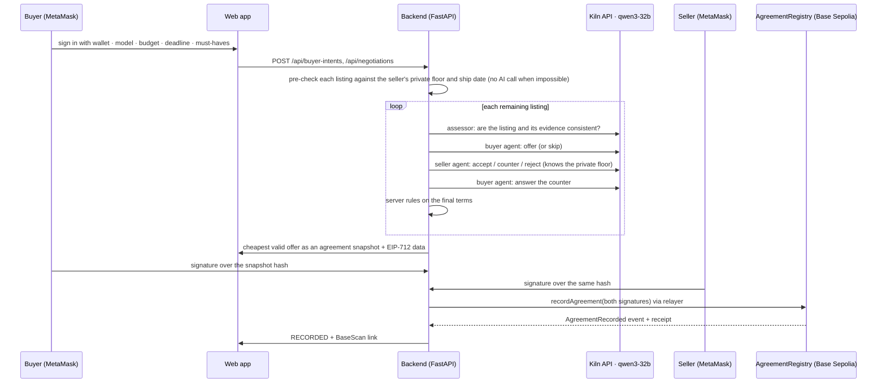

# Agent Accord

**Agent Accord lets Kiln-powered AI agents negotiate a used-GPU deal for a buyer and a seller within each side's private limits, and records the agreement on Base Sepolia only after both people sign the same terms with their own wallets.**

> 한 줄 소개: 구매자와 판매자가 조건만 정하면 Kiln(Qwen3-32B) 에이전트가 증빙을 검토하고 서로의 비공개 한도 안에서 흥정하며, 두 사람이 같은 합의서에 지갑으로 서명하면 그 합의를 Base Sepolia에 기록합니다.

Track A · GWDC 2026 × Bricksum · Repository: `release` branch

| | |
|---|---|
| **AI (Kiln `qwen3-32b`)** | reviews each listing's evidence, makes the buyer's offer, answers as the seller (accept / counter / reject), answers counters, and can skip a listing it judges unsafe |
| **Server rules** | budget, seller floor, delivery deadline, stock and must-haves are checked in code; a model answer that breaks a rule is discarded and re-asked once, then the listing is blocked |
| **Chain** | `AgreementRegistry` verifies **both** EIP-712 signatures on-chain before it stores the agreement hash; payment and shipping are out of scope |

## Demo runs (Track A)

Each row is a real run: real Kiln calls and, where both people signed, a real Base Sepolia transaction. Per-call logs are in [`docs/PROOF.md`](docs/PROOF.md).

| Run | Condition | What the agents did | Result |
|---|---|---|---|
| 1 · normal | budget ₩2,400,000 · 10 days | reviewed 3 listings; buyer agent **skipped Gaming OC** (warranty lookup shows another model); seller 01's agent broke the price rule twice, so the server blocked it; ROG Strix's seller agent countered and the buyer agent accepted | ROG Strix ₩2,105,000, signed in the web UI with MetaMask, recorded |
| 2 · new budget | budget ₩2,000,000 | server dropped the two listings the budget can't reach **before any AI call**; agents closed on the Founders Edition | ₩1,920,000, recorded |
| 3 · new deadline | deadline 3 days | listings that can't ship in time dropped before any AI call; seller agent countered on price/date | ₩1,940,000, recorded |
| 4 · goal impossible | budget ₩1,000,000 | every listing is below its seller's floor, so Accord **declines with the reason for each** and spends no Kiln tokens | no agreement, nothing to sign or record |

Declines are never silent: each stop is an audit event (`CANDIDATE_BLOCKED`, `LISTING_SKIPPED`, `COUNTER_REJECTED`, `OFFER_REJECTED` …) with a reason code, shown in the web UI under **기록**.

## Proof of API usage (per flow)

<!-- proof:start -->

| Flow | Buyer condition | Kiln calls | Kiln cost | Agreement | Signed by | On-chain tx |
|---|---|---|---|---|---|---|
| 1 · 정상 실행 (웹 · MetaMask) | RTX 4090 · 예산 2,400,000원 · 기한 2026-10-10 | 8/11 | $0.000578 | RECORDED 2,105,000원 | MetaMask in the web UI | [`0x42099967…1ca1e6`](https://sepolia.basescan.org/tx/0x42099967ade43a437993739e40e400be50b007f1516a875fc0fbfc24811ca1e6) |
| 2 · 예산 변경 재실행 | RTX 4090 · 예산 2,000,000원 · 기한 2026-10-09 | 3/3 | $0.000171 | RECORDED 1,920,000원 | local test wallets via scripts/run_flows.py | [`0x8dbadc19…804919`](https://sepolia.basescan.org/tx/0x8dbadc1998fb60276992c5a53c23bd746edd4577265d5a84a9e64c830d804919) |
| 3 · 기한 변경 재실행 | RTX 4090 · 예산 2,400,000원 · 기한 2026-10-02 | 4/4 | $0.000206 | RECORDED 1,940,000원 | local test wallets via scripts/run_flows.py | [`0x92d71f32…96c269`](https://sepolia.basescan.org/tx/0x92d71f32579b00f205b4aec6c0646060f75d81f3fc4dcc278ae31614e296c269) |
| 4 · 목표 불가 → 거절 | RTX 4090 · 예산 1,000,000원 · 기한 2026-10-10 | 0/0 | $0.000000 | BLOCKED  | - | - |
| (참고) 첫 MetaMask 실행 | RTX 4090 · 예산 2,400,000원 · 기한 2026-10-09 | 10/12 | $0.000636 | RECORDED 2,105,000원 | MetaMask in the web UI | [`0x10afa7be…616ec2`](https://sepolia.basescan.org/tx/0x10afa7beea789bb553967366342599273839c29536e641eacc1b1851fc616ec2) |

- Total Kiln cost for these flows: $0.001591 · 15,626 tokens
- Model calls avoided: 7 candidate(s) failed the server's budget/deadline pre-check, so no Kiln call was made for them (about 3 calls each: assessment, buyer offer, seller reply).
- Energy (assumption, not a measurement): at 0.3 Wh per 1,000 tokens, ≈ 4.69 Wh for these flows.

Full per-call log: [docs/PROOF.md](docs/PROOF.md)

<!-- proof:end -->

How to read it:

- **Kiln calls `ok/total`**: calls that did not end in `OK` are logged answers that broke a rule (`INVALID_OUTPUT`, re-asked once) or provider errors. Nothing is hidden or retried silently.
- **Kiln log** ([`docs/proof/kiln_calls.jsonl`](docs/proof/kiln_calls.jsonl)): one line per call with the Kiln generation id (`x-neocloud-generation-id`), input/output/reasoning tokens, `usage.cost`, latency, outcome and the validated JSON answer. It holds no prompt text (only its SHA-256) and no key.
- **On-chain**: each tx calls `recordAgreement` on [`0x265756b7d5C4CeEd6976F87E54E44ED0921ac013`](https://sepolia.basescan.org/address/0x265756b7d5C4CeEd6976F87E54E44ED0921ac013) and emits `AgreementRecorded`. `scripts/export_proof.py --verify` re-reads every receipt from the RPC. Deployment tx [`0x63d48e4b…ec5ab6`](https://sepolia.basescan.org/tx/0x63d48e4bcd3891bc591b8e1aa2d998097c060cb58a68b9b8e9fe247e6bec5ab6).
- **Signers**: runs 1 and (참고) were signed by two MetaMask accounts in the browser. Runs 2 and 3 went through the same HTTP API and contract via [`scripts/run_flows.py`](scripts/run_flows.py), signed by local test wallets.
- **Run 4** has no tx by design: there is no agreement to sign. Its audit trail is in `docs/proof/flows.json`.

## How it works



**Kiln** ([`backend/agent.py`](backend/agent.py)): OpenAI-compatible `POST https://api.bricksum.com/v1/chat/completions`, model checked with `GET /models`. Qwen3 runs with `/no_think` (about 1–3 s a call). Replies are parsed to the first JSON object after removing `<think>` blocks and code fences, then validated in code. 429, 5xx and timeouts are retried up to 3 times, honouring `retry-after`. 401 and 402 are reported as `KILN_AUTH_FAILED` / `KILN_CREDITS_EXHAUSTED`.

**Chain** ([`contracts/src/AgreementRegistry.sol`](contracts/src/AgreementRegistry.sol), [`blockchain/`](blockchain)): the snapshot (prices, total, delivery, warranty, evidence hashes, both wallets, expiry, buyer nonce) is canonicalised (RFC 8785) and hashed. Both parties sign the same EIP-712 message. Only the relayer can submit. The contract recovers both signers, rejects reused nonces, expired or duplicate agreements. The backend marks `RECORDED` only when the receipt, the event and the stored values all match.

**Privacy between the two sides**: the buyer's budget never reaches the seller agent or seller screen. The seller's floor and ship date never reach the buyer. Seller-agent text is shown to the buyer with amounts masked.

## Run it

Needs Python 3.12+, Node 20+, a Kiln API key, two MetaMask accounts, and a little Base Sepolia ETH for the relayer.

```sh
git clone https://github.com/siwooju-dev/agent-accord.git && cd agent-accord && git checkout release
python3 -m venv .venv && .venv/bin/pip install -r backend/requirements.txt
(cd contracts && npm ci && npm run compile)
(cd frontend && npm ci)
```

**Try without keys (mock agents, no chain):**

```sh
bash scripts/run_backend.sh mock                                   # API on 127.0.0.1:8000
cd frontend && npm run dev -- --host 127.0.0.1 --port 5180         # open http://127.0.0.1:5180
```

**Live (Kiln + Base Sepolia):**

```sh
.venv/bin/python scripts/setup_secrets.py         # paste the Kiln key (hidden); creates a testnet relayer, prints its address only
# add the two MetaMask public addresses to .env.local: DEMO_BUYER_WALLET=0x…  DEMO_SELLER_WALLET=0x…
.venv/bin/python scripts/deploy_registry.py       # once, after funding the relayer from a faucet
.venv/bin/python scripts/kiln_smoke.py            # optional: one Kiln negotiation, no chain
DATABASE_PATH=data/live.sqlite3 PORT=8001 bash scripts/run_backend.sh live
cd frontend && ACCORD_API_TARGET=http://127.0.0.1:8001 npm run dev -- --host 127.0.0.1 --port 5180
```

In the app, sign in with **구매자로 로그인** (account 1), pick a condition under **조건 · 매물**, and press **이 조건으로 협상 시작**. Watch the agents talk under **협상**, then sign under **합의 · 서명**. Log out, switch MetaMask to account 2, sign in with **판매자로 로그인**, and sign the same agreement. **기록** shows every event, each Kiln call and the BaseScan link.

- Scripted runs: `.venv/bin/python scripts/run_flows.py A B C`.
- Rebuild the proof: `scripts/export_proof.py --db data/live.sqlite3 --db data/live-script.sqlite3 --verify --publish --flow … --label …`.
- Share over ngrok and run the full QA checklist: [`docs/WEB_QA.md`](docs/WEB_QA.md).

Keys live only in the git-ignored `.env.local` (mode 600) and the backend process, never in the browser bundle. Live mode accepts only the configured buyer and seller wallets. Each buyer wallet can start 20 negotiations an hour (`NEGOTIATIONS_PER_HOUR`).

## Tests

```sh
.venv/bin/python -m pytest -q backend/tests blockchain/tests     # 58 tests: API rules, wallet auth, Kiln parsing/retries, signing, local EVM
(cd frontend && npm test && npm run build)
```

## Built before vs. during the event

- **Before the event: nothing.** All code, contracts, data and docs in this repository were written during the event. The first commit is 2026-09-28 02:35 KST (`git log --reverse`).
- **Third-party code used as-is**: FastAPI, Pydantic, web3.py, eth-account, OpenAI Python SDK (as the Kiln client), OpenZeppelin Contracts (ECDSA, EIP712), solc, React, Vite, viem, lucide-react.
- **Media**: listing photos and clips from Wikimedia Commons (CC BY 3.0 / CC BY-SA 4.0), paper texture from ambientCG (CC0); credits in the app footer and [`DESIGN.md`](DESIGN.md). The three seeded listings, their receipts and warranty lookups are fictional samples made for the demo.
- **Tools**: AI coding assistants (OpenAI Codex, Claude) were used during development.

## Limits

- Evidence is a written summary of what a file shows; the assessor checks consistency between summaries, not authenticity or whether a GPU works.
- Testnet records only: no payment, escrow or delivery.
- One seller MetaMask account stands in for the three demo sellers.

## Repository

| Path | What |
|---|---|
| `backend/` | FastAPI API v0.2 ([`api-spec.md`](api-spec.md)): wallet sign-in, Kiln agents, rule checks, SQLite store |
| `blockchain/` | EIP-712 payloads, relayer adapter, deploy script, deployment record |
| `contracts/` | `AgreementRegistry` (Solidity 0.8.28) |
| `frontend/` | React app. `/` is the live app (`src/connected/`), `?mode=console` an API console, `?mode=mock` the offline design ([`DESIGN.md`](DESIGN.md)) |
| `scripts/` | secrets setup, deploy, Kiln smoke test, backend runner, scripted flows, proof export |
| `docs/` | [`PROOF.md`](docs/PROOF.md), `proof/` raw logs, [`WEB_QA.md`](docs/WEB_QA.md) |
