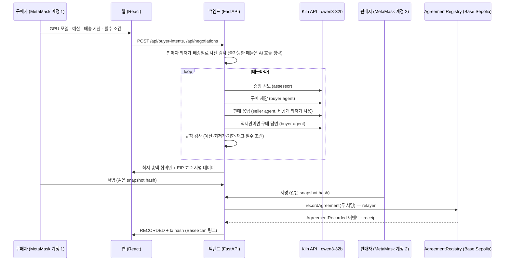

# Agent Accord

**구매자와 판매자가 중고 GPU 거래 조건을 입력하면 Kiln API의 Qwen3-32B 에이전트들이 증빙을 검토하고 협상해 합의안을 만들고, 양측이 같은 합의 내용에 지갑으로 서명하면 그 기록을 Base Sepolia 테스트넷 트랜잭션으로 남기는 구매 지원 서비스.**

- AI는 **판단과 협상**을 한다: 증빙 요약의 일관성 검토, 구매 제안, 판매 응답(수락·역제안·거절), 역제안에 대한 구매 답변.
- 서버 코드는 **규칙 검사**를 한다: 예산, 판매자 최저가, 배송 기한, 재고, 필수 조건. AI가 규칙을 어긴 답을 내면 버리고 한 번 다시 묻는다. 그래도 어기면 그 매물은 차단한다.
- 체인은 **합의 기록**만 한다. 결제·인도·소유권 이전은 하지 않는다. 컨트랙트가 구매자·판매자 두 서명을 직접 검증한 뒤에만 기록한다.

> 데모 데이터(매물·증빙·영수증)는 모두 가상이다. 증빙은 파일이 아니라 "파일에 무엇이 보이는지"를 적은 요약이며, AI는 요약끼리의 일관성만 판단한다. 진품·작동 여부를 확인했다고 주장하지 않는다.

## 흐름



## Kiln API 사용

| 역할 | 단계 | 입력 | 출력 (JSON) |
|---|---|---|---|
| assessor | `assessment` | 매물 설명, 증빙 요약 | 증빙별 `consistent / conflicted / unverified` + 한국어 메모 |
| buyer | `buyer_offer` | 구매 조건, 매물, 검토 결과 | 제안가·배송일·보증 문구 또는 `skip`(위험한 매물 건너뜀) |
| seller | `seller_reply` | 매물, 비공개 최저가·출고일, 구매 제안 | `accept / counter / reject` + 가격·배송일 |
| buyer | `buyer_reply` | 역제안 | `accept / reject` |

- 엔드포인트 `https://api.bricksum.com/v1/chat/completions`, 모델 `qwen3-32b` (OpenAI 호환). 시작할 때 `GET /models`로 모델을 확인한다.
- Qwen3 `/no_think` 스위치로 추론 단계를 끈다(호출당 약 1~3초). `<think>` 블록과 코드펜스를 걷어내고 첫 JSON 객체만 쓴다.
- 429·5xx·타임아웃은 `retry-after`/`x-ratelimit-reset`을 따라 최대 3번 시도한다. 401·402는 `KILN_AUTH_FAILED`, `KILN_CREDITS_EXHAUSTED`로 구분해 감사 로그에 남긴다.
- **모든 호출을 기록한다**: `x-neocloud-generation-id`, 입력·출력·추론 토큰, `usage.cost`(USD), 지연, 결과. 프롬프트 원문과 키는 기록하지 않는다(프롬프트는 SHA-256만). 코드: [`backend/agent.py`](backend/agent.py)

## 블록체인 사용

- 컨트랙트 [`contracts/src/AgreementRegistry.sol`](contracts/src/AgreementRegistry.sol) (Base Sepolia, chain 84532). 배포 정보: [`blockchain/deployments/base-sepolia.json`](blockchain/deployments/base-sepolia.json)
- 합의 내용(가격·배송비·총액·배송일·보증·증빙 해시·양측 지갑·만료·nonce)을 정규화해 해시하고, 구매자와 판매자가 **같은 EIP-712 데이터**에 서명한다.
- `recordAgreement`는 지정된 relayer만 부를 수 있고, 컨트랙트 안에서 두 서명을 `ECDSA.recover`로 검증한다. 구매자 nonce 재사용·만료·중복 기록을 막는다.
- 백엔드는 receipt 성공 + `AgreementRecorded` 이벤트 + 컨트랙트 저장값이 모두 맞을 때만 `RECORDED`로 표시한다. mock 모드는 `MOCK_RECORDED`이며 tx hash가 없다.

## 실행 방법

필요: Python 3.12+, Node 20+, Chrome + MetaMask(계정 2개), Kiln API 키, Base Sepolia 테스트 ETH 약간(relayer용).

```sh
git clone https://github.com/siwooju-dev/agent-accord.git && cd agent-accord
python3 -m venv .venv && .venv/bin/pip install -r backend/requirements.txt
(cd contracts && npm ci && npm run compile)
(cd frontend && npm ci)
```

### 1. 비밀값 (터미널에서 직접 입력)

```sh
.venv/bin/python scripts/setup_secrets.py
```

Kiln 키를 붙여넣으면(화면에 표시되지 않음) git에서 제외된 `.env.local`(권한 600)에 저장하고, `GET /models`로 확인한다. relayer 지갑이 없으면 새로 만들고 **주소만** 출력한다. 이 주소로 [Base Sepolia faucet](https://docs.base.org/base-chain/network-information/network-faucets)에서 테스트 ETH를 받는다. 키는 브라우저·Vite 변수에 절대 넣지 않는다.

`.env.local`에 MetaMask 공개 주소 두 개를 추가한다(개인키 아님).

```sh
DEMO_BUYER_WALLET=0x...   # MetaMask 계정 1
DEMO_SELLER_WALLET=0x...  # MetaMask 계정 2 (데모 판매자 3명이 같이 씀)
```

### 2. 컨트랙트 배포 (한 번)

```sh
.venv/bin/python scripts/deploy_registry.py --check   # relayer 주소·잔액 확인
.venv/bin/python scripts/deploy_registry.py           # 배포 후 blockchain/deployments/base-sepolia.json 갱신
```

### 3. 실행

```sh
.venv/bin/python scripts/kiln_smoke.py     # (선택) 체인 없이 Kiln 협상 1회 점검
scripts/run_backend.sh live                # Kiln + Base Sepolia, DB는 data/live.sqlite3
cd frontend && npm run dev                 # http://localhost:5173/?mode=live
```

체인·Kiln 없이 화면만 보려면 `scripts/run_backend.sh mock`, 디자인 데모는 `http://localhost:5173/`.

### 4. 화면에서

1. `buyer-demo`로 세션 → MetaMask 계정 1 연결(Base Sepolia 자동 추가) → 조건 입력 → **협상 시작**. 20초 안팎에 합의안이 나온다.
2. 합의안 확인 → 구매자 서명.
3. `seller-demo-N`(합의안의 판매자)으로 세션 → MetaMask 계정 2로 바꾸고 → 같은 합의안에 서명.
4. 두 서명이 모이면 relayer가 기록하고, `RECORDED`와 BaseScan 링크가 뜬다. **흐름 감사**에서 Kiln 호출(generation id·토큰·비용)과 이벤트를 볼 수 있다.

### 5. 증빙 내보내기

```sh
.venv/bin/python scripts/export_proof.py --db data/live.sqlite3 --verify \
  --label <flow_id>="기본" --label <flow_id>="예산 변경" --label <flow_id>="기한 변경"
```

`docs/PROOF.md`, `docs/proof/flows.json`, `docs/proof/kiln_calls.jsonl`을 만들고 아래 표를 갱신한다. `--verify`는 tx receipt를 RPC에서 다시 확인한다. 같은 컨트랙트에 기록한 뒤에는 `data/live.sqlite3`를 지우지 않는다(구매자 nonce가 다시 1부터 시작해 거절된다).

## API 사용 증빙 (Proof of API usage)

흐름 3개: 기본 조건 → 예산을 낮춘 조건 → 배송 기한을 당긴 조건. 흐름마다 Kiln 호출 기록과 합의 기록 트랜잭션이 있다.

<!-- proof:start -->
(`scripts/export_proof.py` 실행 후 채워짐)
<!-- proof:end -->

## 테스트

```sh
.venv/bin/python -m pytest -q backend/tests blockchain/tests
(cd frontend && npm test && npm run build)
```

Kiln 에이전트 테스트는 가짜 HTTP 응답으로 `<think>` 처리, 재질문, 429 재시도, 402 구분, 로그에 키가 없는지를 확인한다.

## 대회 전 작업 공개 (Pre-built work disclosure)

- 저장소의 코드와 문서는 모두 대회 기간에 작성했다. 첫 커밋은 2026-09-28 02:35(KST)이며 커밋 기록으로 확인할 수 있다.
- 외부 라이브러리: FastAPI, Pydantic, web3.py, eth-account, OpenAI Python SDK(Kiln 호출용), OpenZeppelin Contracts(ECDSA·EIP712), solc, React, Vite, viem, lucide-react.
- 사진·영상: Wikimedia Commons(CC BY 3.0 / CC BY-SA 4.0), 종이 질감 ambientCG(CC0). 출처 목록은 화면 하단과 [`DESIGN.md`](DESIGN.md).
- 개발에 AI 코딩 도구(OpenAI Codex, Claude)를 사용했다.

## 한계

- 데모 세션(`ALLOW_DEMO_SESSIONS=true`)은 인증이 아니다. 발표용 통제 환경에서만 켠다.
- 증빙 파일 자체를 검증하지 않는다. 테스트넷 기록이며 결제나 실물 거래가 아니다.
- relayer 키는 테스트넷 전용이다. 메인넷 키를 쓰지 않는다.

## 저장소 구조

| 경로 | 내용 |
|---|---|
| `backend/` | FastAPI API v0.1 ([`api-spec.md`](api-spec.md)), Kiln 에이전트, 규칙 검사, SQLite |
| `blockchain/` | EIP-712 서명 데이터, relayer 어댑터, 배포 스크립트, 배포 기록 |
| `contracts/` | AgreementRegistry (Solidity 0.8.28) |
| `frontend/` | React 웹. `/?mode=live`가 실제 API 흐름, `/`는 디자인 데모 ([`DESIGN.md`](DESIGN.md)) |
| `scripts/` | 비밀값 설정, 배포, Kiln 점검, 실행, 증빙 내보내기 |
| `docs/` | 증빙 (`PROOF.md`, `proof/`) |
