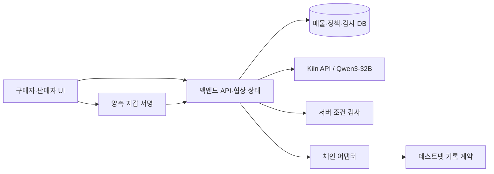

# 프로젝트: 중고 GPU 구매·판매 에이전트 협상

> 상태: 설계 문서. 여기 적힌 API·계약·화면은 구현 목표이며 현재 동작한다는 뜻이 아니다. 모든 개발 에이전트는 이 문서, `api-spec.md`, 자기 역할 문서를 읽는다.

## 한 문장 정의

**구매자와 판매자가 중고 GPU 거래 조건을 입력하면 Kiln API의 Qwen3-32B 에이전트들이 합의안을 제안하고, 양측이 동일한 조건에 서명해 승인한 뒤 합의 기록을 테스트넷 트랜잭션으로 남기는 구매 지원 서비스.**

제출할 README에도 이 기능을 한 문장으로 선언한다.

## 사용자와 범위

- 구매자는 예산, GPU 모델, 상태, 배송 기한, 보증 조건을 지키면서 여러 매물을 비교하고 싶다.
- 판매자는 최저 판매가와 배송 가능 조건을 지키면서 반복적인 흥정을 줄이고 싶다.
- MVP는 구매자 1명, 중고 GPU 한 모델군, 판매자 2~3명, 판매자별 `초기 제안 + 최대 2회 반대 제안`이다.
- 결과는 `합의 불가/거절` 또는 **양측이 승인한 단일 구매 합의안과 검증 가능한 온체인 기록**이다.
- 온체인 거래의 의미는 **합의 기록**이다. 실제 원화 결제, 실물 인도, 소유권 이전은 MVP에서 다루지 않는다. UI에서 결제 완료라고 표현하지 않는다.

## Challenge A 수용 기준 대응

| 요구 | 시연할 증거 |
| --- | --- |
| 사용자 문제·AI 역할 | 구매 예산을 지키는 협상; AI의 평가·제안과 서버 코드의 조건 검사를 구분 |
| Kiln API | 실제 Qwen3-32B 호출·응답이 제안에 반영된 기록, 역할/단계별 토큰 사용량 |
| 효율 | AI 호출을 생략한 경우, 호출 수·토큰 수, 실측 또는 가정을 명시한 에너지 추정 |
| 블록체인 | devnet/testnet 실제 트랜잭션 1건 이상, tx hash, 성공 영수증, 대응 이벤트/조회 기록 |
| 조건 검증 | 기본 실행 뒤 사용자 조건을 바꾼 실행 2회, 차단/성공을 재구성할 수 있는 로그 |

제공된 PDF에는 과거 모델명 `gpt-oss-120b`가 적혀 있고 팀이 전달받은 최신 기준은 `Qwen3-32B`다. [Kiln 공식 모델 문서](https://kiln.bricksum.com/docs/en/models)의 모델 ID는 `qwen3-32b`이며, 팀은 발급받은 키로 이 모델에 접근 가능하다는 안내를 받았다. 백엔드 연결 시 `GET /models` 확인과 실제 `POST /chat/completions` 호출 결과를 기록한다. Kiln 연결 규칙은 `api-spec.md` 8절을 따른다. 배포 체인은 아래의 Base Sepolia로 정했고 운영진이 다른 체인을 지정하면 변경 근거를 제출물에 남긴다. 모델 이름만 표시하는 모의 호출은 실제 Kiln 통합으로 간주하지 않는다.

## 구성

| 구성 | 책임 |
| --- | --- |
| AI | 매물 설명·증빙 요약, 모순/미확인 점 표시, 가격·배송·보증 제안과 이유 작성 |
| 서버 코드 | 권한, 정확한 금액/기한/재고 검사, 라운드·상태 관리, 단일 합의 스냅샷 생성, 중복 제출 방지 |
| 사람 | 구매자와 선택된 판매자가 같은 합의안을 각각 승인하거나 거절 |
| 블록체인 | 양측 서명을 검증하고 합의 해시와 최소 거래 정보를 기록·조회 |

에이전트는 지갑 서명이나 최종 승인을 대신하지 않는다. 판매자 설명은 판매자 주장이다. 현재 Kiln 모델 목록에서 `qwen3-32b`는 이미지 입력을 지원하지 않으므로 MVP의 증빙 검토는 데이터 담당이 준비한 **텍스트·메타데이터**와 판매자 설명의 대조로 한정한다. 사진 원본을 모델이 직접 판독했다고 주장하지 않는다. AI는 기록 간 모순을 찾을 수 있지만 GPU의 진품·실제 작동을 확정할 수 없다.

## 기술 스택·개발 환경 확정

| 담당 | 기술 | 소유 경로 |
| --- | --- | --- |
| 프론트 | React + TypeScript + Vite, 지갑 연결·EIP-712 서명에 viem | `frontend/` |
| 백엔드/AI | Python 3.12 + FastAPI/Pydantic, Kiln에 OpenAI Python SDK, 체인 RPC/계약 호출에 web3.py | `backend/` |
| 데이터 | Python 표준 `sqlite3` + SQLite; SQL 초기화·시드·저장소 함수 | `data/` |
| 블록체인 | Solidity + Foundry + OpenZeppelin EIP712/ECDSA, Python 체인 어댑터 | `contracts/`, `blockchain/` |

백엔드는 `data/`의 저장소 함수와 `blockchain/`의 어댑터를 호출한다. 프론트는 `/api` 상대 경로로 호출하고 개발 중 Vite가 `http://localhost:8000`의 FastAPI로 프록시한다. 백엔드 앱 진입점은 `backend/main.py`이며 저장소 루트에서 `python -m uvicorn backend.main:app --reload --port 8000`으로 실행한다. 프론트는 npm을 사용하며 `frontend/`에서 `npm run dev`로 실행한다. DB 기본 경로는 `data/demo.sqlite3`, 계약 빌드·테스트는 `contracts/`에서 `forge build`·`forge test`다. 백엔드는 FastAPI가 생성한 `/openapi.json`을 제공한다. 의존성은 프론트 `package-lock.json`, 백엔드 `requirements.txt`, 계약 `foundry.toml`과 고정된 라이브러리 버전으로 관리한다. 프론트는 지갑 개인키를 받거나 저장하지 않는다.

## 테스트넷 확정

MVP 배포 대상은 **Base Sepolia**다. chain ID `84532`, 기본 공개 RPC `https://sepolia.base.org`, 탐색기 `https://sepolia.basescan.org`를 사용한다. 공개 RPC가 불안정하면 같은 체인의 다른 RPC로 `CHAIN_RPC_URL`만 교체한다. 로컬 개발은 Foundry Anvil을 사용하되 제출 증거는 Base Sepolia의 실제 tx여야 한다. 운영진이 특정 체인을 지정하면 그 요구에 맞춰 환경 설정·서명 도메인·계약 배포를 함께 변경한다. Base Sepolia 가스는 테스트 ETH로 충당한다. [Base chain ID](https://docs.base.org/base-chain/api-reference/ethereum-json-rpc-api/eth_chainId) · [Base Sepolia RPC 예시](https://docs.base.org/cookbook/use-case-guides/finance/access-real-time-asset-data-pyth-price-feeds/) · [BaseScan](https://docs.basescan.org/sepolia-basescan)

## 공통 데이터 계약 v0

금액은 정수 KRW, 시간은 UTC ISO 8601, ID는 고유 문자열이다. API·DB·체인 간 필드 변경은 이 문서를 먼저 갱신하고 네 담당자에게 알린다.

| 객체 | 핵심 필드 | 공개 범위·규칙 |
| --- | --- | --- |
| `BuyerIntent` | `id`, `buyer_id`, `gpu_model`, `max_total_krw`, `delivery_deadline`, `must_have` | 최고 총예산은 구매자와 서버만 열람 |
| `SellerPolicy` | `seller_id`, `listing_id`, `min_item_price_krw`, `earliest_delivery_at` | 최저가는 해당 판매자와 서버만 열람 |
| `Listing` | `id`, `seller_id`, `gpu_model`, `asking_price_krw`, `shipping_fee_krw`, `condition_text`, `warranty_end`, `stock_status`, `evidence_ids` | 공개 매물; 원문과 수정 이력 유지 |
| `Evidence` | `id`, `listing_id`, `kind`, `source`, `ref`, `sha256`, `verification_status` | 상태는 `seller_claimed/checked/conflicted/unknown`; AI 열람만으로 `checked`가 되지 않음 |
| `ListingAssessment` | `flow_id`, `listing_id`, `summary`, `findings`, `source` | 근거별 `consistent/conflicted/unverified` 판정; `consistent`는 실물 검증을 뜻하지 않음 |
| `Offer` | `id`, `negotiation_id`, `listing_id`, `round`, `proposer`, `item_price_krw`, `shipping_fee_krw`, `total_krw`, `delivery_by`, `warranty_terms`, `expires_at`, `evidence_ids`, `rationale` | 모델 출력은 초안; 서버 검증 통과 후 노출; 설명은 공개 가능한 내용만 |
| `Agreement` | `id`, `offer_id`, `snapshot`, `snapshot_hash`, `buyer_wallet`, `seller_wallet`, `buyer_signature`, `seller_signature`, `status`, `tx_hash` | 양측은 동일한 불변 스냅샷에 서명 |
| `AuditEvent` | `id`, `flow_id`, `at`, `actor`, `event_type`, `object_id`, `decision`, `reason_code` | 조건 검사·차단·승인·체인 결과를 순서대로 재구성 |
| `ModelUsage` | `flow_id`, `actor`, `step`, `model_id`, `request_id`, `input_tokens`, `output_tokens`, `latency_ms`, `source` | `source`로 API 실측과 추정 구분 |

`Agreement.snapshot`에는 스냅샷 버전, 합의 ID, 매물 ID·공개 상품 정보, 상품가/배송비/총액, 배송 기한, 보증, 참조 증빙 해시, 양측 지갑 주소, 만료 시각, nonce를 포함한다. 비공개 최고예산/최저가는 포함하지 않는다. 증빙 해시 순서·시각·nonce 형식과 계약 함수·이벤트는 `api-spec.md` 4.8절 및 `blockchain.md`의 v1 규격을 따른다. 스냅샷 변경은 새 해시와 새 양측 승인을 요구한다.

## 전체 워크플로우

1. 구매자와 판매자가 조건/매물을 등록한다. 서버가 형식과 계정 권한을 검사한다.
2. DB가 모델, 재고, 배송 등 명확한 필드로 매물을 찾는다. 후보가 없으면 Kiln 호출 없이 `NO_MATCH`로 종료한다. MVP에는 RAG나 외부 사이트 크롤링을 넣지 않는다.
3. Kiln Qwen3-32B 평가기가 설명과 증빙의 텍스트·메타데이터를 구조화하고 근거 ID, 모순, 미확인 점을 남긴다.
4. 구매자 에이전트 1개와 판매자별 에이전트가 **분리된 문맥**으로 Kiln을 호출해 제안을 교환한다. 상대방의 비공개 가격 한계는 프롬프트에 전달하지 않는다.
5. 서버가 매 제안마다 `총액 = 상품가 + 배송비 + 명시 수수료 <= 구매자 최고예산`, `상품가 >= 판매자 최저가`, 모델·재고·기한·필수 조건·만료를 검사한다. 실패 제안은 전송/승인하지 않고 이유를 기록한다.
6. 유효 제안 중 한 건을 선택해 불변 합의 스냅샷을 만든다. 구매자와 선택 판매자가 **같은 내용**을 각각 확인하고 지갑으로 서명한다. 거절/만료/내용 변경 시 제출하지 않는다.
7. 백엔드와 기록 계약이 양측 서명을 검증한다. 서버의 relayer 지갑이 실제 테스트넷 트랜잭션을 제출한다.
8. 성공 영수증, 이벤트, 계약 조회값과 오프체인 합의 해시를 대조한 뒤 `RECORDED`로 표시한다. 실패는 `CHAIN_FAILED`로 남긴다.

상태: `DRAFT → NEGOTIATING → PROPOSED → AWAITING_APPROVALS → RECORDING → RECORDED`. 종료 상태: `NO_MATCH`, `BLOCKED`, `REJECTED`, `EXPIRED`, `CHAIN_FAILED`. 한 합의는 최대 한 번 기록된다.

## 서명·온체인 기록의 의미

배포 대상은 **Base Sepolia**다. 양측은 EIP-712 형식의 동일한 `snapshot_hash`, 당사자 주소, 합의 총액, nonce, 만료 시각에 서명한다. 계약은 서명자·만료·중복을 확인하고 합의 해시, 당사자 주소, 합의 총액, 기록 시각을 저장하며 이벤트를 발행한다. 온체인에는 사진 원본, 연락처, 배송지, 비공개 가격 한계, 개인키를 올리지 않는다.

이 설계가 증명하는 것은 **두 주소가 같은 합의 해시에 서명했고 그 기록이 체인에 포함됐다는 사실**이다. 서버가 모든 제안을 보는 MVP는 입찰 비밀성이나 경매 공정성을 암호학적으로 증명한다고 주장하지 않는다. 커밋-공개 방식은 후속 범위다.

## API·어댑터 요약

HTTP 요청·응답, 권한, 오류, 승인 서명 형식의 상세 계약은 `api-spec.md`를 따른다. 아래 표는 흐름을 읽기 위한 요약이다.

| 기능 | 경로/함수 | 반환 |
| --- | --- | --- |
| 데모 사용자 선택 | `POST /api/demo/sessions` | 가상 계정 세션 |
| 구매 조건/매물 등록 | `POST /api/buyer-intents`, `POST /api/listings` | 생성 ID |
| 협상 시작/조회 | `POST /api/negotiations`, `GET /api/negotiations/{id}` | 상태, 매물 평가·근거, 유효 제안·협상 이유, 차단 이유 |
| 내 합의 목록 | `GET /api/agreements` | 승인 대기·완료 합의 |
| 승인 자료/결정 | `GET /api/agreements/{id}/approval-payload`, `POST /api/agreements/{id}/decisions` | 동일 스냅샷·서명 데이터, 승인/거절 상태 |
| 합의/감사 조회 | `GET /api/agreements/{id}`, `GET /api/flows/{id}/audit` | 양측 승인, tx hash/영수증, 사건·토큰 내역 |
| 체인 어댑터 | `prepare_approval`, `verify_signature`, `record_agreement`, `get_record` | typed data, 검증 결과, tx/체인 기록 |

백엔드 담당이 `api-spec.md`를 구현하고 OpenAPI와 일치시킨다. mock과 실제 Kiln/체인은 같은 결과 타입을 써도 화면·로그에서 구분한다. mock tx를 실제 온체인 기록으로 표시하지 않는다.

## 데모·완료 기준

| 실행 | 바뀐 조건 | 기대 결과 |
| --- | --- | --- |
| A 기본 | 예산·기한 충족 | AI 협상 → 양측 서명 → 실제 테스트넷 tx → 영수증/이벤트/조회 일치 |
| B 예산 변경 | 최고 총예산 감소 | 다른 유효안 또는 차단; 초과 제안이 확정되지 않았음을 로그로 증명 |
| C 기한 변경 | 배송 기한 단축 | 조건을 만족하는 판매자만 남거나 종료; 차단 이유와 AI 호출 수 확인 |

추가 테스트: 판매자 최저가 미만 제안, 매물 설명 속 지시문 삽입, 설명·증빙 충돌, 한쪽 거절, 서명 대상 변경, 중복 tx, 체인 실패. 데모/가상 매물을 실제 판매나 시세로 표기하지 않는다. 시세를 사용한다면 출처·표본 수·수집 시각·비교 조건을 함께 표시한다.

완료 시 **실제 Kiln 응답이 제안에 영향을 주는지**, 서버 검사가 양측 한계를 지키는지, 양측이 같은 해시에 서명했는지, 최소 1건의 실제 체인 tx와 맞는 로그가 있는지, A/B/C를 기록만으로 재구성할 수 있는지 검증한다. 에너지 수치는 실측 또는 명시한 가정으로 산정한다.

## 네 팀원의 작업 구분

| 담당 | 읽을 파일 | 소유 영역 | 전달물 |
| --- | --- | --- | --- |
| 프론트 | `project.md` → `frontend.md` | `frontend/` | 조건/협상/승인/영수증 UI, 지갑 서명 |
| 백엔드/AI | `project.md` → `backend-ai-agent.md` | `backend/` API·서비스·Kiln | OpenAPI, 협상/정책 엔진, 감사/사용량 |
| 데이터 | `project.md` → `data.md` | `data/` DB 스키마·초기화·시드·저장소 | 스키마, 가상 매물, 조회·기록 기능 |
| 블록체인 | `project.md` → `blockchain.md` | `contracts/`·`blockchain/` 체인 어댑터 | 계약, 서명 규격, 배포/tx 검증 |

공통 객체와 예시 응답을 먼저 합의한 뒤 각 역할이 병렬 구현한다. 다른 역할의 소유 파일을 임의로 덮어쓰지 않는다. 키·토큰·개인키는 환경 변수/비밀 저장소만 사용한다. 각 개발 에이전트는 보고 시 변경 파일, 실행한 검증, 실제/모의 외부 호출, 남은 제약과 필요한 인계를 명시한다.

## 구현 순서

1. 객체·상태·API 예시, 서명용 스냅샷/해시 규칙 합의.
2. 데이터 스키마와 시드, 백엔드 조건 엔진, 프론트 mock 화면 병렬 작업.
3. 실제 Kiln 연결 및 협상, 블록체인 계약/서명/어댑터 연결.
4. A/B/C 전체 실행, 토큰·효율 표와 실제 tx 증거 검증.
